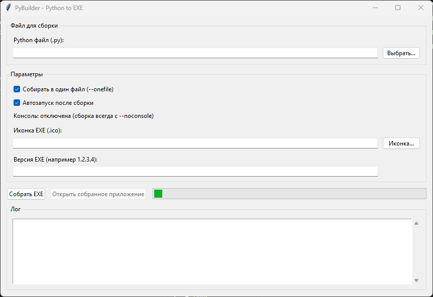

# PyBuilder

`PyBuilder` — GUI-приложение на Python (Tkinter) для сборки `.py` → `.exe` через **PyInstaller**.

## Разработчики

- **Road Soft**

## Возможности

- Сборка в **один файл** (`--onefile`) или в папку
- Сборка **без консоли** (`--noconsole`)
- Поддержка **иконки** (`.ico`)
- (Опционально) генерация **version info** для EXE (версия вида `1.2.3.4`)
- Лог процесса сборки прямо в окне
- Автозапуск EXE после успешной сборки

## Требования

- Windows 10/11
- Python 3.10+ (рекомендуется)
- PyInstaller (установится автоматически из приложения, либо вручную)

## INSTALL (Установка)

### Вариант 1 — запустить из исходников

1) Установите Python с сайта [python.org](https://www.python.org/downloads/) и включите опцию **Add Python to PATH**.

2) (Рекомендуется) Создайте виртуальное окружение:

```bash
py -m venv .venv
.\.venv\Scripts\Activate.ps1
```

3) Установите зависимости (минимум — PyInstaller):

```bash
py -m pip install -U pip
py -m pip install -U pyinstaller
```

4) Запуск:

```bash
py .\pybuilder.py
```

### Вариант 2 — скачать готовый EXE

- Готовый файл лежит в `GitVersion\PyBuilder.exe` (если вы его туда скопировали) или в `dist\PyBuilder.exe` после сборки.

## Сборка EXE (PyInstaller)

### Быстрая сборка одной командой (с иконкой)

Из корня проекта:

```powershell
py -m PyInstaller --noconfirm --clean --onefile --noconsole --name "PyBuilder" --icon ".\icon.ico" ".\pybuilder.py"
```

Результат: `.\dist\PyBuilder.exe`

### Сборка через spec-файл

```powershell
py -m PyInstaller --noconfirm --clean ".\PyBuilder.spec"
```

## Как пользоваться

1) Запустите `pybuilder.py` (или `PyBuilder.exe`).
2) Нажмите **Выбрать...** и укажите ваш `.py` файл.
3) При необходимости включите/выключите параметры сборки.
4) Укажите иконку `.ico` (опционально).
5) Нажмите **Собрать EXE**.

## Структура проекта

- `pybuilder.py` — исходный код приложения
- `PyBuilder.spec` — spec-файл PyInstaller (опционально)
- `icon.ico` — иконка приложения (если используется)
- `dist/` — выходные файлы PyInstaller (генерируется)
- `build/` — промежуточные файлы PyInstaller (генерируется)
- `GitVersion/` — папка для выкладки (EXE + исходники)

## Примечания

- Папки `build/` и `dist/` являются **артефактами сборки** и пересоздаются.
- Если сборка не стартует, проверьте, что `py` доступен в PowerShell:

```powershell
py --version
```

